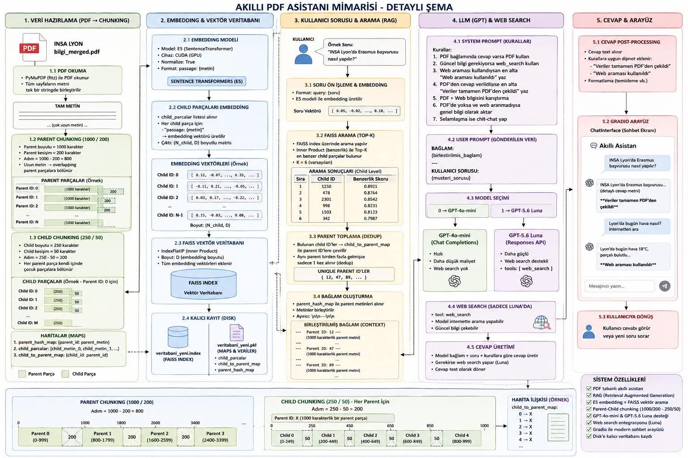

# 💼 Akıllı Asistan: Hiyerarşik RAG Tabanlı Doküman Asistanı

Gelişmiş **Parent-Child Chunking (Hiyerarşik Parçalama)** mimarisi ve **FAISS vektör indeksi** kullanarak PDF dokümanları üzerinden bağlamsal ve yüksek doğruluklu yanıtlar üreten yeni nesil bir **RAG (Retrieval-Augmented Generation)** asistanıdır. Kullanıcı dostu Gradio web arayüzü ile entegre çalışır.

---

## 📌 Temel Özellikler

- **Hiyerarşik Metin Bölümleme (Parent-Child Chunking):** 
  - Geleneksel RAG yaklaşımlarında karşılaşılan bağlam kaybı problemini çözer.
  - Vektör benzerlik araması hassasiyet için küçük metin blokları (**Child Chunks - 250 karakter**) üzerinde yapılır.
  - LLM'e bilgi aktarılırken, anlam bütünlüğünü korumak adına bu blokların bağlı olduğu geniş üst bloklar (**Parent Chunks - 1000 karakter**) gönderilir.
- **Yüksek Performanslı Vektör Arama:** 
  - Çok dilli `intfloat/multilingual-e5-base` embedding modeli.
  - `FAISS` (Facebook AI Similarity Search) ile milisaniyeler düzeyinde vektör sorgulama (`IndexFlatIP` - Cosine Similarity).
- **Çift Model / Mod Desteği:**
  - **Sıkı Doküman Odaklı Mod (`gpt-4o-mini`):** Sadece sağlanan PDF içeriğine sadık kalır; halüsinasyonu engeller.
  - **Gelişmiş Araştırma Modu (`gpt-5.6-luna` + Web Search):** PDF bağlamı yetersiz kaldığında otomatik web araması yaparak güncel ve birincil kaynaklardan yanıtı tamamlar.
- **Canlı ve Dinamik İndeksleme:** 
  - Gradio arayüzü üzerinden tek tıkla yeni PDF yükleme ve anlık FAISS veritabanı güncelleme desteği.
  - Disk önbellekleme (`.index` ve `.pkl`) sayesinde modeli her açılışta yeniden eğitmeden anında başlatabilme.

---

## 🏗️ Mimari & Çalışma Mantığı

<p align="center">
  
</p>
```text
[ PDF Dokümanı ] 
       │
       ▼
[ Hiyerarşik Bölümleme (Parent-Child Chunking) ]
       │
       ├──► Child Chunks (250 char) ──► Multilingual-E5 Embeddings ──► FAISS Index
       │                                                                   │
       └──► Parent Chunks (1000 char) ──► Hash Map Deposu (Pickle)         │
                                                                           │ (Benzerlik Araması)
[ Kullanıcı Sorusu ] ────────► E5 Query Vector ─────────────────────────────┘
                                                                           │
                                                                           ▼
                                                             [ En Alakalı Parent Metinler ]
                                                                           │
                                                                           ▼
                                                             [ LLM (GPT-4o-mini / Luna) ] ──► [ Yanıt + Kaynak Notu ]
```

---

## 📂 Proje Dizin Yapısı

```text
├── Akıllı Asistan.py      # Ana uygulama dosyası (RAG, FAISS & Gradio Arayüzü)
├── requirements.txt       # Gerekli Python kütüphaneleri
├── .gitignore             # Depoya dahil edilmeyecek dosyalar listesi
└── README.md              # Proje dokümantasyonu
```

---

## 🚀 Kurulum & Başlangıç

### 1. Depoyu Klonlayın
```bash
git clone https://github.com/<kullanici-adiniz>/<repo-adiniz>.git
cd <repo-adiniz>
```

### 2. Sanal Ortam Oluşturun ve Aktif Edin
```bash
# Sanal ortamı oluşturun
python -m venv venv

# Windows:
venv\Scripts\activate

# macOS / Linux:
source venv/bin/activate
```

### 3. Bağımlılıkları Yükleyin
```bash
pip install -r requirements.txt
```

---

## ⚙️ Yapılandırma

`Akıllı Asistan.py` dosyasını bir metin editöründe açın ve ilgili ayarları yapın:

1. **OpenAI API Anahtarı:**
   ```python
   os.environ["OPENAI_API_KEY"] = "sk-..."  # OpenAI API anahtarınızı girin
   ```
2. **(Opsiyonel) Varsayılan PDF:**
   ```python
   pdf_dosyasi = "ornek_dokuman.pdf"  # Başlangıçta taranmasını istediğiniz PDF yolu
   ```

---

## 🖥️ Kullanım

Uygulamayı başlatmak için terminalden şu komutu çalıştırın:

```bash
python "Akıllı Asistan.py"
```

1. **Konsol Seçimleri:**
   - Önceden oluşturulmuş bir veritabanı varsa `0` seçerek doğrudan başlayabilir veya `1` seçerek yeni bir PDF indeksleyebilirsiniz.
   - Kullanmak istediğiniz LLM modunu (`gpt-4o-mini` veya `gpt-5.6 Luna`) seçin.
2. **Gradio Web Arayüzü:**
   - Konsoldaki seçimlerin ardından web tarayıcınızda arayüz otomatik olarak açılacaktır.
   - Sol taraftaki alandan istediğiniz an yeni bir PDF sürükleyip bırakarak veritabanını güncelleyebilir, sağdaki sohbet ekranından asistanla etkileşime geçebilirsiniz.

---

## 🛡️ Lisans
Bu proje MIT lisansı altında sunulmaktadır.
